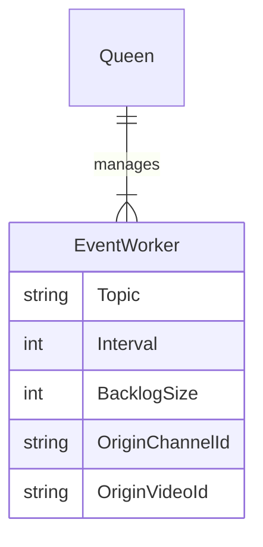

# Fake Bee

Fake Youtube Live event producer.

## Usage

```bash
go build .
fakebee start -b kafka
```

## Worker hierarchy

Each `EventWorker` produces one kind of **events** to one specific **Kafka topic**.


