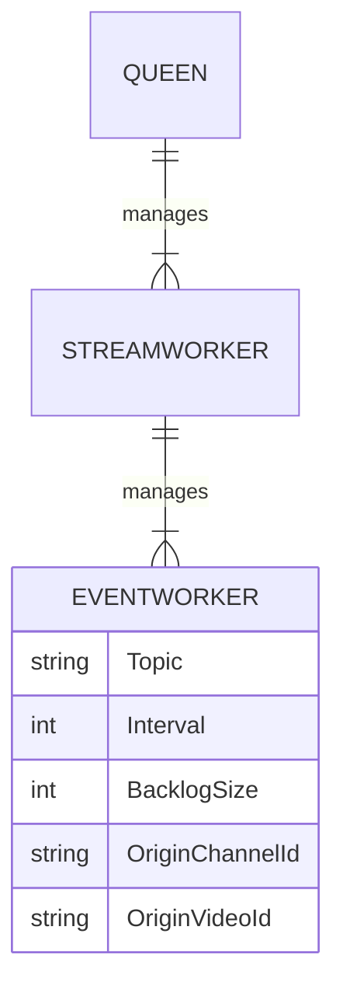

# Fake Bee

Fake Youtube Live event producer.

## Worker hierarchy

Each Youtube Live stream has a 1-to-1 relation with  a `StreamWorker`.
Each `StreamWorker` can create multiple child workers `EventWorker`. Each `EventWorker` produces one kind of **events** to one specific **Kafka topic**.
For example, a `StreamWorker` for stream `1q2w3er4r4t5t` is created, with 3 `TopicWorker`s for 3 topics: `chat`, `superchat`, `membership`.

