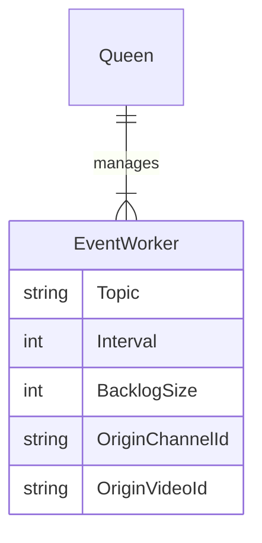

# Fake Bee

FakeBee is a CLI tool that generates fake Youtube Live events, and can produce them either to standard output or to a Kafka broker.

## Usage

```bash
go build .
./fakebee start -b kafka --broker <broker addr>:9092
```

If you need more info about commands, use the `-h` flag.

## Worker hierarchy

Each `EventWorker` produces one kind of **events** to one specific **Kafka topic**.



An `origin` is simply an entity representing a fake source of live chat events (a Youtube Live **stream** from a specific **channel**).

The `topic` can be one of:

- `chats`
- `superchats`
- `superstickers`
- `memberships`
- `milestones`
- `banactions`
- `deleteactions`

`fakebee` will create a corresponding Kafka `topic` if it does not exist in the cluster.
